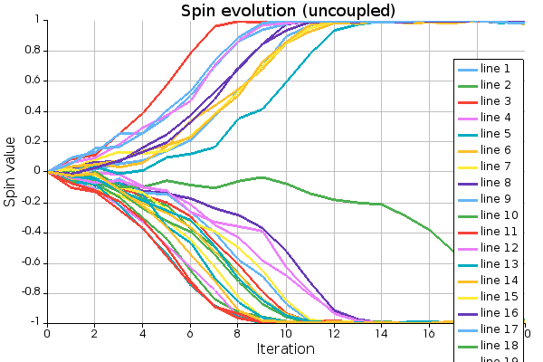
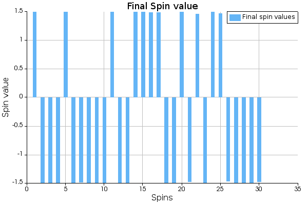
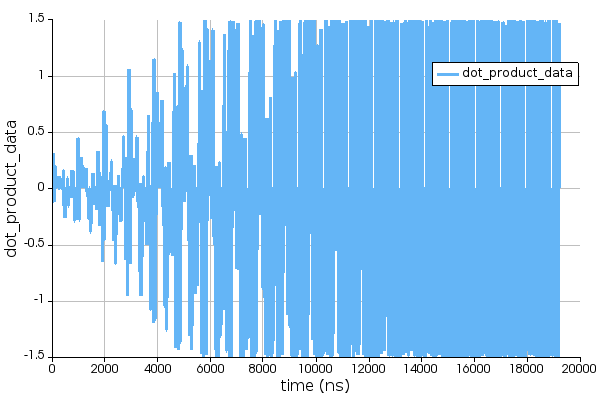

I used Lumerical INTERCONNECT to do some preliminary simulations.

The circuit is driven by a Lumerical INTERCONNECT python co-simulation module.


The cosine operation was done in python for visualization purpose, since the value recorded by the co-sim module id the dotproduct and not the spin value. <br/><br/>
The following results for uncoupled spins were simulated with alpha = 1.5. <br/>




NOTE:
In the code, the following path seems to work:

```
## Uncomment the following if you are using Linux
sys.path.append("/opt/lumerical/v232/python/bin/python3") # linux
sys.path.append("/opt/lumerical/v232/api/python/lumapi.py") 

sys.path.append("/opt/lumerical/v232/python/bin") # linux
sys.path.append("/opt/lumerical/v232/api/python") 

sys.path.append(os.path.dirname(__file__)) #Current directory
```
