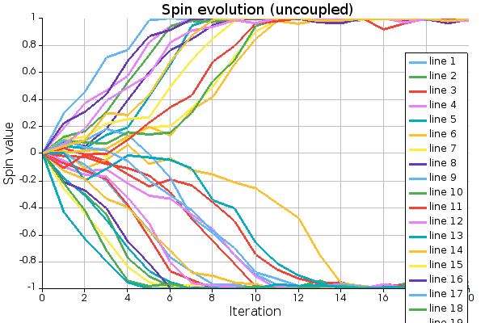
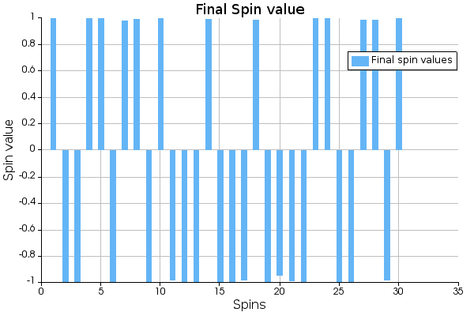

I used Lumerical INTERCONNECT to do some preliminary simulations.

The circuit is driven by a Lumerical INTERCONNECT python co-simulation module.


The cosine operation was done in python for visualization purpose, since the value recorded by the co-sim module id the dotproduct and not the spin value. <br/><br/>
The following results for uncoupled spins were simulated with alpha = 1.5. <br/>



<br/><br/>
The following the simulation result (simulated on Lumerical INTERCONNECT) of a square lattice of 16 spins with alpha = 0.4 and beta = 0.5. TODO: Ceck the hamiltonian function once again and the cut values. Simulation code: `ising_working.py`<br/>


<br/><br/>
Sometimes in the case of MZM, the output amplitude is not driven all the way in the range [-1,1] but in a smaller range around the quadrature point to reduce the voltage swing of the electronic drivers. In those cases, the J matrix is nowmalized with `normalizing_factor = np.max(np.abs(input))/limiter` -> `normalized_input = input/normalizing_factor` where the range is set to [-limiter,limiter]. Fpr the spins, its just clipped at the limiter value. In the following results, the limiter=0.7, alpha = 0.4 and beta = 0.5. Simulation code: `ising_working_clipped_spins.py`. <br/>


<br/><br/>

NOTE:
In the code, the following path seems to work:

```
## Uncomment the following if you are using Linux
sys.path.append("/opt/lumerical/v232/python/bin/python3") # linux
sys.path.append("/opt/lumerical/v232/api/python/lumapi.py") 

sys.path.append("/opt/lumerical/v232/python/bin") # linux
sys.path.append("/opt/lumerical/v232/api/python") 

sys.path.append(os.path.dirname(__file__)) #Current directory
```
