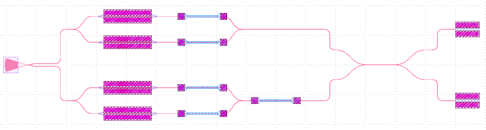
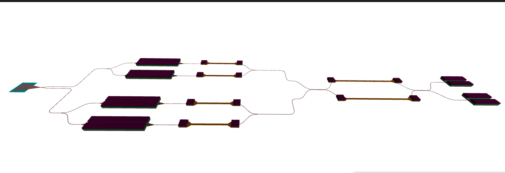
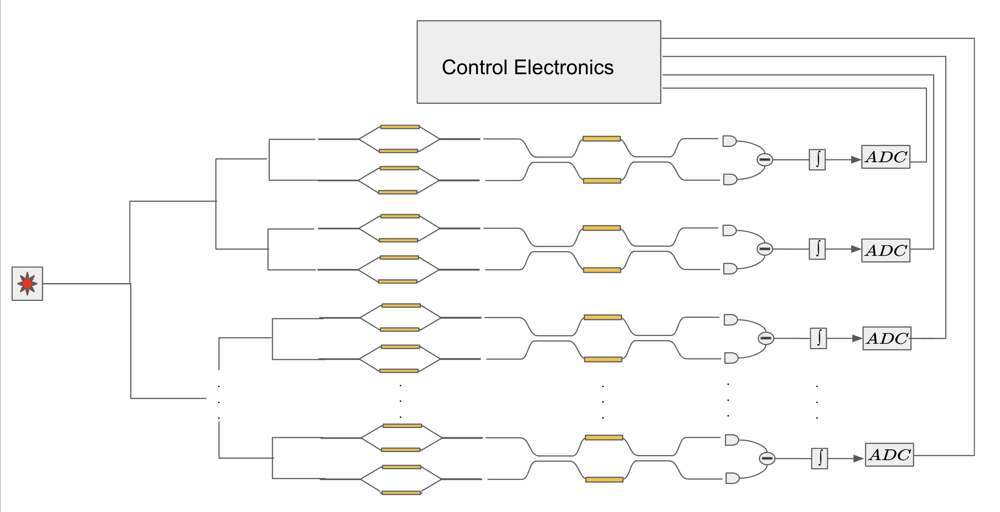
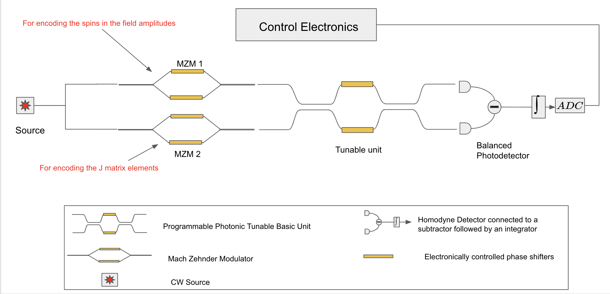
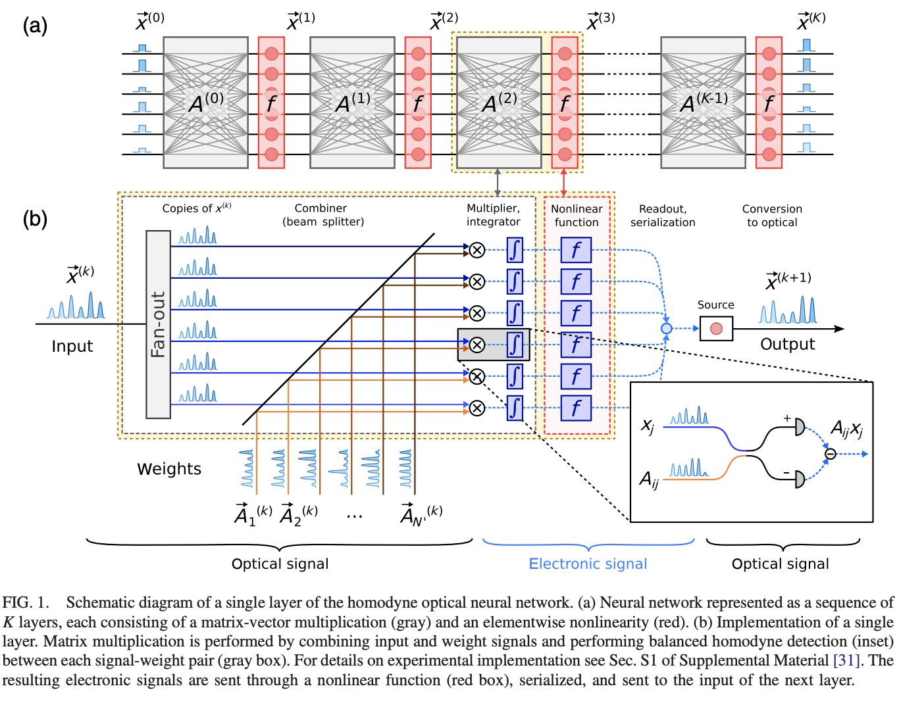
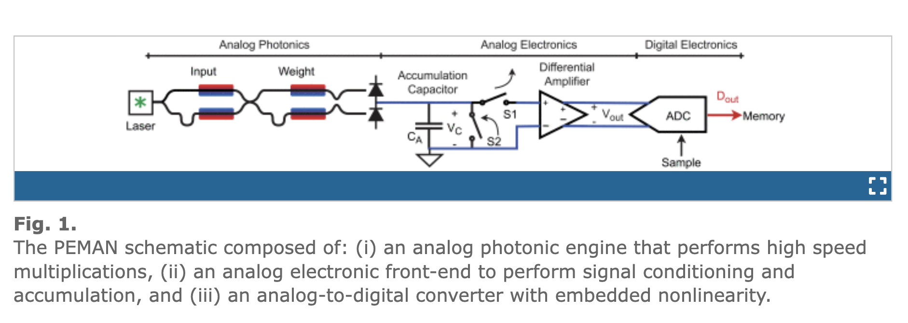
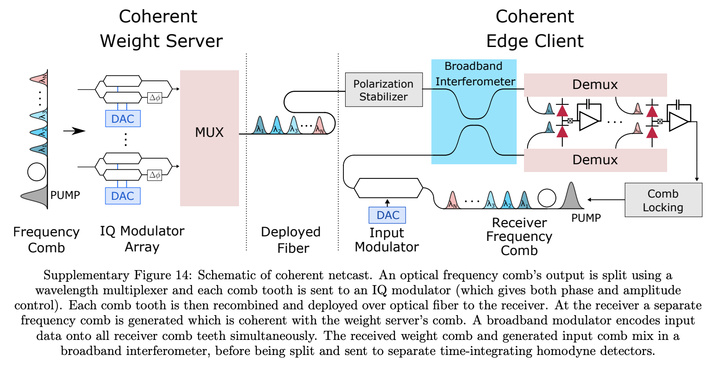
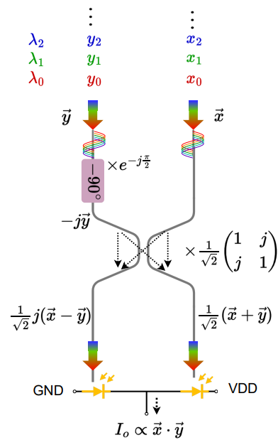

# Photonic_Ising_chip

## Overview

A time-multiplexed Coherent Ising Machine chip is designed based of Silicon Photonics. Basically here I implement the table-top Ising machine design given in reference [1] into a Photonic Integrated Circuit(PIC). Though with some changes. The nonlinear function used for bifurcation in reference [1] is cosine squared since the spin information is encoded in the intensity of light. Here we use just cosine function for bifurcation and encode the spin information in the amplitude of the light. For the matrix multiplication part, and method of photonic matrix multiplication using homodyne-detector given in reference [2] and [4] is used since this system is a time multiplex system.  

The PIC in simulated in Lumerical INTERCONNECT.

## Device Schematic
 

 

 

## Approaches for encoding spins

There are 2 wars to encode the spins.
  - Using time-multiplexing as done in referend [2] and [4]      
  - Using wavelength-multiplexing as done in reference [3]    
  - Wavelength multiplexing variant as done in reference [5]    

## References:  
1. [A poor man’s coherent Ising machine based on opto-electronic feedback systems for solving optimization problems](https://www.nature.com/articles/s41467-019-11484-3) 
1. [Large-Scale Optical Neural Networks Based on Photoelectric Multiplication](https://journals.aps.org/prx/abstract/10.1103/PhysRevX.9.021032) 
1. [Alexander Sludds et al. ,Delocalized photonic deep learning on the internet’s edge.Science378,270-276(2022).DOI:10.1126/science.abq8271](https://www.science.org/doi/10.1126/science.abq8271)
1. [L. De Marinis et al., "A Codesigned Integrated Photonic Electronic Neuron," in IEEE Journal of Quantum Electronics, vol. 58, no. 5, pp. 1-10, Oct. 2022, Art no. 8100210, doi: 10.1109/JQE.2022.3177793.](https://ieeexplore.ieee.org/document/9781309) 
1. [DOTA: A Dynamically-Operated Photonic Tensor Core for Energy-Efficient Transformer Accelerator](https://arxiv.org/abs/2305.19533) 
